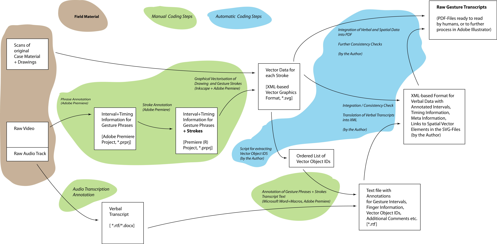
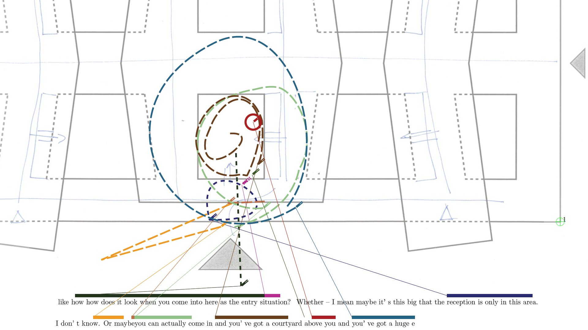
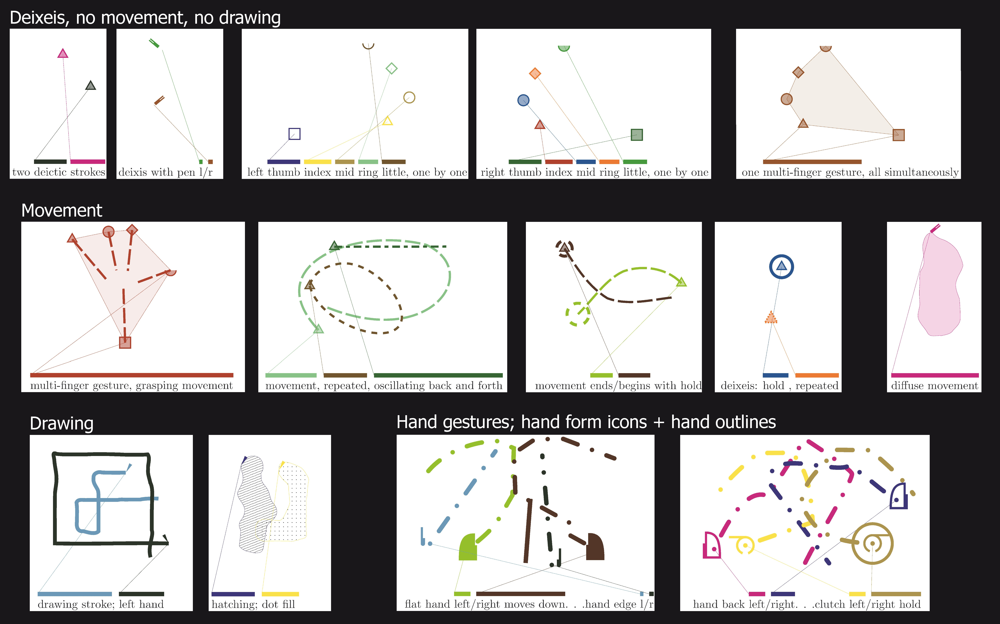

SpaDoAK: Spatial Domain Annotation Kit
======================================

**Annotation of Gestures and Sketches**

by Martin Brösamle

Initially developed for internal use at SFB/TR8, Spatial Cognition.
Currently unmaintained.

The software was used for data analysis of video-recorded architectural design sessions.

`./spadoak` (the package directory)
-----------------------------------

+ Combine verbal and spatial annotation data into human readable form.

+ 15 min of video-recorded design activity will result in approx. 50 pages of PDF.

Gesture Annotation Workflow
---------------------------

### Sample Transcript Page

### Annotation Language Cheat Sheet

